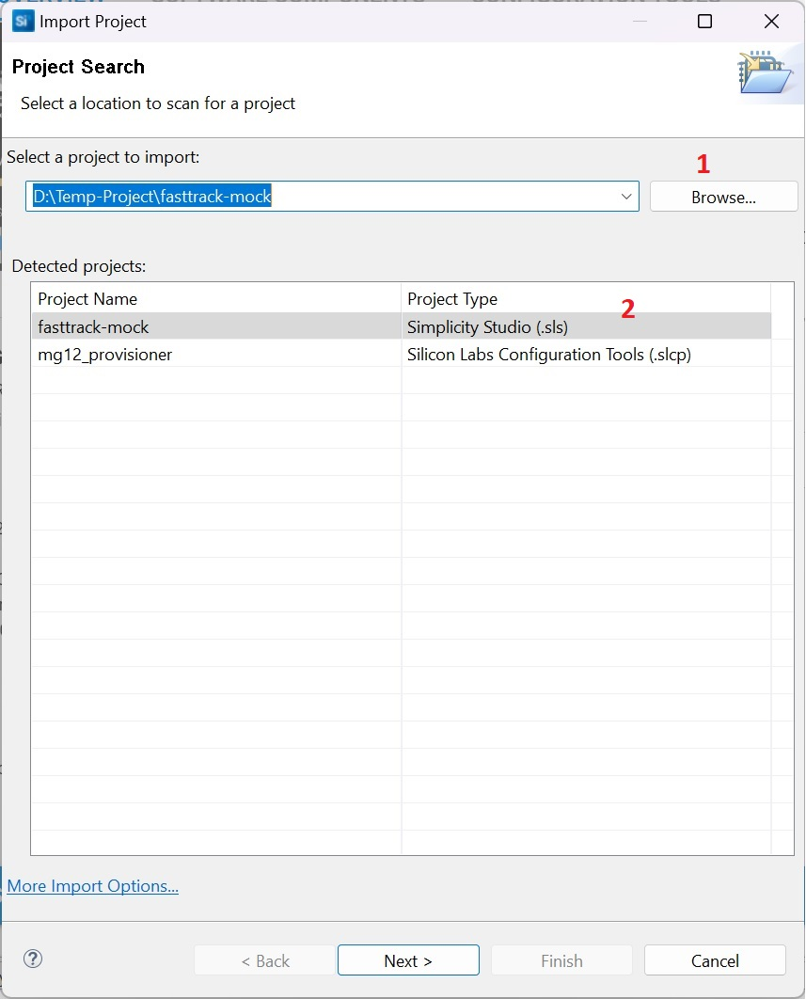
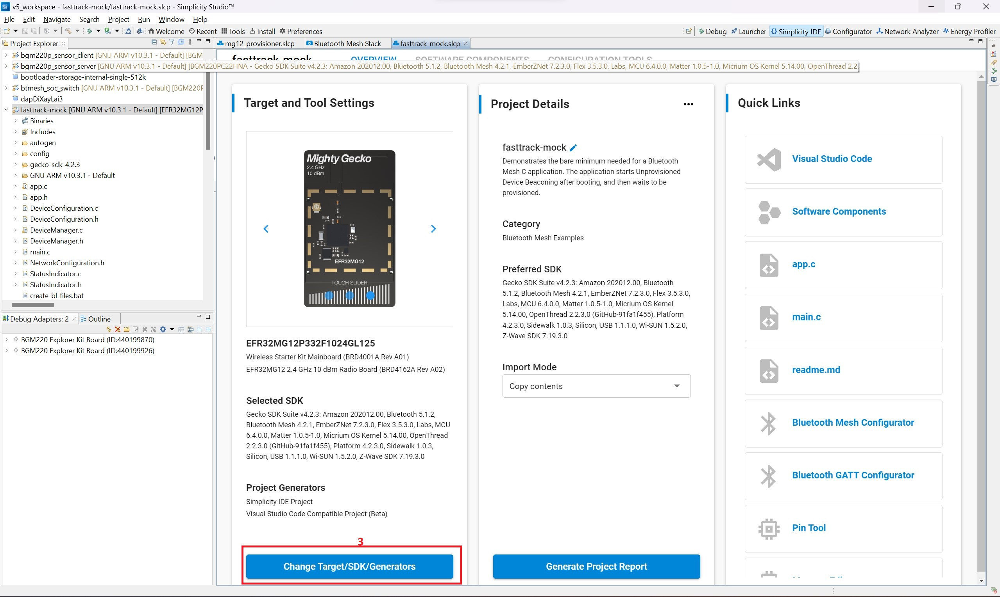

# Hướng dẫn sử dụng

Xin hãy đọc kĩ hướng dẫn này trước khi thao tác. Luôn phải có bản backup cho code của mình, nếu gặp vấn đề hoặc thấy dấu hiệu lạ, hãy tham khảo trợ giúp trên mạng hoặc từ người xung quanh.

Hướng dẫn này được dựa trên nhiều mẩu kinh nghiệm thu thập từ nhiều nguồn, hoạt động khác nhau. Do đó, nếu thấy có gì thiếu sót hoặc cảm thấy cần góp ý, đừng ngần ngại nêu ra ý kiến.

Nếu chưa từng sử dụng git/github, hãy tìm hiểu về những khái niệm cơ bản nhất của git để có thể nhanh chóng tiếp cận tài liệu này. Git là một công cụ lớn, nhưng để bắt đầu làm quen và sử dụng hằng ngày thì không cần biết quá nhiều.

Một số keyword cần quan tâm như:

1. Commit
2. Branch/tag
3. Pull
4. Push
5. Conflicts
6. Merge/pull request

Có rất nhiều tài nguyên ở nhiều dạng, từ text đến video để học git:

1. [Sách ProGit](https://git-scm.com/book/en/v2) - Trước mắt quan tâm chương 2, 3, 5

## Về file gitignore

Trong thư mục project do Simplicity Studio tạo ra, có một vài thư mục không đáng hoặc không phù hợp để sao chép giữa các máy. Ví dụ như thư mục `autogen` là nơi chứa các file code do Sim tự tạo ra dựa vào thiết lập của các Software Component, hay như tập tin chứa các file output của quá trình build project...

Do đó tập tin `.gitignore` được thêm vào là để loại bỏ việc git theo dõi lại các file/thư mục trên. Tập tin này đã được chỉnh sửa và thử nghiệm sao cho git repo này chỉ chứa lượng thông tin vừa đủ khi import vào Simplicity Studio.

Đừng thấy lạ nếu thư mục trên Github thiếu đi một vài file hoặc thư mục có trên máy tính.

## Cách import project đã clone vào workspace của Simplicity Studio

Sau khi clone được project về thì sẽ tiến hành import nó vào workspace của Simplicity Studio. Các bước thực hiện như bên dưới:

1. Mở cửa sổ Sim, chọn bảng công cụ Project -> Import -> MCU Project...
2. Cick vào Browse rồi chọn tới thư mục project vừa clone về
3. Chương trình sẽ tự scan project có thể import, khi ấy, trên màn hình sẽ có 2 loại file có thể import: .sls và .slcp. Lưu ý là chỉ chọn file .sls
4. Click Next. Cửa sổ tiếp theo là để chọn thư mục lưu project vào, cứ để mặc định cũng được
5. Rồi ấn Finish

Khi này project đã được import xong nhưng vẫn còn thiếu một vài thư mục tự generate bởi phần mềm. Để gen file còn thiếu:

1. Mở file .slcp
2. Ở cửa sổ Tool & Settings, phần Target and Tool Settings, kéo xuống dưới để click vào Change/Target/SDK/Generators
3. Không cần thanh đổi gì, ấn Save luôn

Sau khi gen xong, nhớ build thử xem có vấn đề gì không.

## Hướng dẫn chung khi sử dụng repo này

Mỗi một project sẽ được đặt trong một thư mục của repo này. Những ai làm việc liên quan tới project nào thì sẽ chỉ nên thao tác trên thư mục của mình.

Để đơn giản hóa việc sử dụng git thì repo này sẽ chỉ có một branch duy nhất là master (hoặc main). Tất cả mọi người sẽ đều commit chung vào branch này.

Một khi code đã ổn định, hoạt động như mong muốn hoặc đạt một mục tiêu nào đó thì sẽ được tách sang branch khác để lưu lại. Sau đó việc thay đổi, sửa xóa, phát triển vẫn sẽ tiếp diễn trên branch chính.

## Hướng dẫn chi tiết về Workflow

Do có nhiều người cùng làm trên một nhánh, sẽ không tránh khỏi việc gặp lỗi, conflict khi pull hoặc push. Nên để hạn chế số vấn đề gặp phải thì hãy tham khảo workflow ở phần [How to resolve conflicts when pulling](#how-to-resolve-conflicts-when-pulling)

## Một số vấn đề và cách khắc phục

### How to resolve conflicts when pulling

Khi pull, git sẽ kéo dữ liệu từ repo remote về local, điều này có thể sẽ dẫn tới một số lỗi

1. Conflict: Có nhiều người cùng sửa một file, git không biết nên giữ lại phần nội dung nào.
2. Nếu chưa commit, git sẽ báo lỗi, yêu cầu commit những thay đổi ở local để tránh mất dữ liệu khi pull
3. ...

Cách xử lý như sau:

1. Nếu chưa commit, thực hiện commit nội dung local
2. Dùng git pull để kéo dữ liệu về, nếu có conflict, git sẽ báo file bị conflict.
3. Mở file conflict để chỉnh sửa (xóa nội dung, hoặc gộp thủ công nội dung file)
4. Commit lại
5. Push lên remote.

Phần nội dung conflict do người khác thay đổi có thể là quan trọng, hãy tham khảo ý kiến chủ commit trước khi sửa, xóa, gộp để đi đến giải pháp toàn diện nhất.
