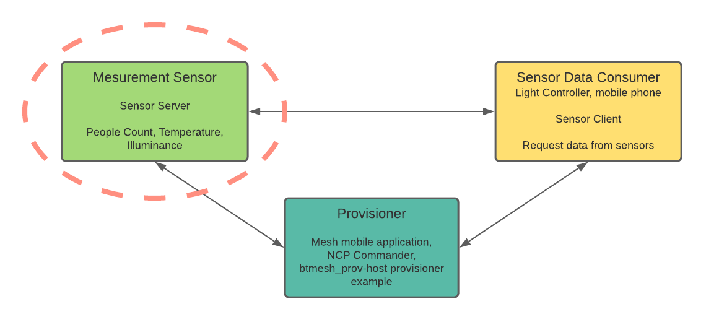
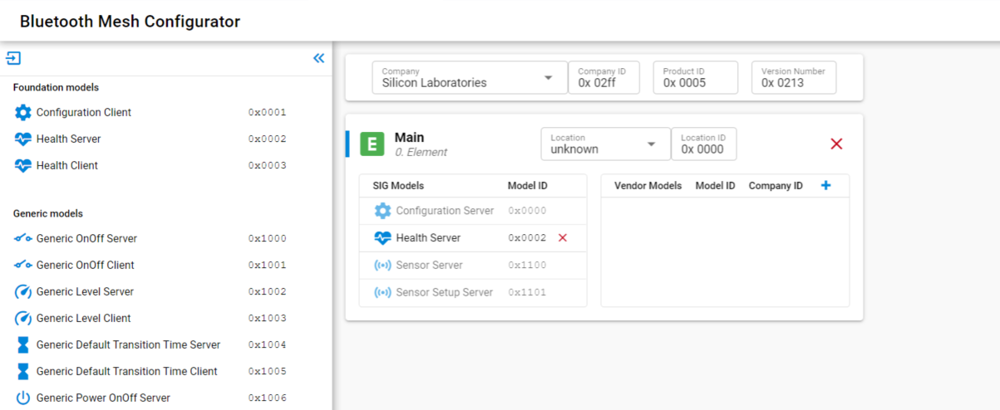
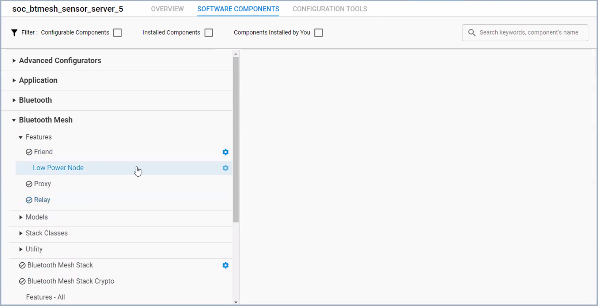
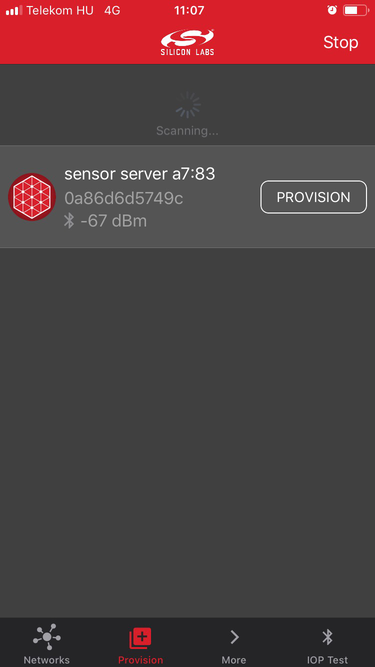
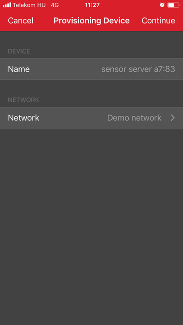
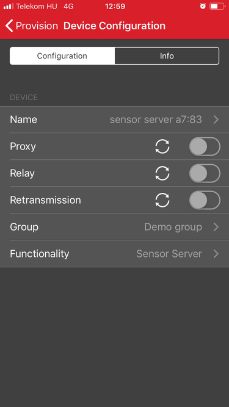
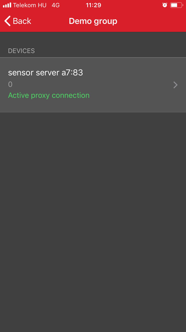

# Bluetooth Mesh - SoC Sensor Server

The **Bluetooth Mesh - SoC Sensor Server** example is a working example application you can use as a template for Bluetooth Mesh Sensor Server applications.

The example demonstrates the Bluetooth Mesh **Sensor Server Model**. It demos for creating motion by pushing the button (code run for **BGM220 Explore kit**) and sends the signal to a remote device (for example, **Bluetooth Mesh - SoC Sensor Client**). This example requires one of the Internal Storage Bootloader (single image) variants, depending on the device's memory.

## Getting Started

To learn Bluetooth mesh technology basics, see [Bluetooth Mesh Network - An Introduction for Developers](https://www.bluetooth.com/wp-content/uploads/2019/03/Mesh-Technology-Overview.pdf).

To get started with Bluetooth Mesh and Simplicity Studio, see [QSG176: Bluetooth Mesh SDK v2.x Quick Start Guide](https://www.silabs.com/documents/public/quick-start-guides/qsg176-bluetooth-mesh-sdk-v2x-quick-start-guide.pdf).

The term SoC stands for "System on Chip", meaning that this is a standalone application that runs on the EFR32/BGM and does not require any external MCU or other active components to operate.

To add or remove features from the example, follow this process:

- Add model and feature components to your project
- Optionally configure your Mesh node through the "Bluetooth Mesh Configurator"

To learn more about programming an SoC application, see [UG472: Silicon Labs Bluetooth ® Mesh Configurator User's guide for SDK v2.x](https://www.silabs.com/documents/public/user-guides/ug472-bluetooth-mesh-v2x-node-configuration-users-guide.pdf).

- Some components are configurable and can be customized using the Component Editor

- Respond to the events raised by the Bluetooth stack
- Implement additional application logic

[UG295: Silicon Labs Bluetooth ® Mesh C Application Developer's Guide for SDK v2.x](https://www.silabs.com/documents/public/user-guides/ug295-bluetooth-mesh-dev-guide.pdf) gives code-level information on the stack and the common pitfalls to avoid.

## Device Firmware Update

Device Firmware Update (DFU) is a new feature introduced in the Bluetooth Mesh Model specification v1.1 that provides a standard way to update device firmware over a Bluetooth mesh network. The example has the Updating node functionality enabled by default that is fulfilled by installing the Firmware Update and BLOB Transfer model components:

- Firmware Update Server
- BLOB Transfer Server
- 
For more information on the DFU examples, see **AN1370: Bluetooth® Mesh Device Firmware Update Example Walkthrough**. To learn the basics of the Bluetooth Mesh Device Firmware Update specification, see **AN1319: Bluetooth® Mesh Device Firmware Update**.

## GUILINE SENSOR SERVER

To run the application, do the following:

1. Make sure a bootloader is installed. See the Troubleshooting section.
2. Build and flash the **Bluetooth Mesh - SoC Sensor Server** example to your device.
3. If not run in low power mode, do step 6.
For run an example of a Low Power Node-enabled energy-efficient Bluetooth Mesh switch application. The example needs to remove logging features: event logging, log, iostream usart, and command line interface.
And then add features: low power node. When adding a low-power node will have some problems, you need to re-config in components: Blob transfer server and Firmware update server. You can refer config in the example **Bluetooth Mesh - SoC Switch low power node** 
5. Delete file app_out_log.c
6. Copy the file below into the project: app.c, app.h, sl_btmesh_set_uuid.c, sl_btmesh_set_uuid.h.
7. If you want to change the uuid device, do this step. In file sl_bluetooth.c: add function sl_btmesh_set_my_uuid(evt) before function
sl_bt_provisionee_on_event(evt). And then build and flash to the device again.
8. Reset the device by pressing and releasing the reset button on the mainboard while pressing BTN0. The message "Factory reset" should appear on the LCD screen if not run in a low-power node.
9. Provision the device in one of three ways:

   - NCP Host provisioner examples, see for example an SDK folder `app/btmesh/example_host/btmesh_host_provisioner` or [github](https://github.com/SiliconLabs/bluetooth_mesh_stack_features/tree/master/provisioning)

   - NCP Commander with NCP target device, see [Bluetooth NCP Commander guide](https://docs.silabs.com/simplicity-studio-5-users-guide/latest/ss-5-users-guide-tools-bluetooth-ncp-commander) or [AN1259: Using the v3.x Silicon Labs Bluetooth Stack in Network Co-Processor Mode](https://www.silabs.com/documents/public/application-notes/an1259-bt-ncp-mode-sdk-v3x.pdf)

   - For Mobile Phone use, see the [QSG176: Bluetooth Mesh SDK v2.x Quick-Start Guide](https://www.silabs.com/documents/public/quick-start-guides/qsg176-bluetooth-mesh-sdk-v2x-quick-start-guide.pdf) for more information how to download and use the Silicon Labs Bluetooth Mesh application.

   Mobile Phone provisioning is illustrated in the following figure.

10. Open the app and choose the Provision Browser and tap **Scan**. The device sending unprovisioned beacons should appear, tap **PROVISION**:

11. Start provisioning using the "Continue" button:

12. Configure the device as "Sensor Server" (inheriting the server setup model) and select the correct group to which the messages will subscribe (Demo group).

13. Once the node is provisioned and correctly configured, it is ready to function in your demo network.

14. The next step is to add a sensor client or several into your network if it has not already been done. This is required to fully test the whole system. Read the applicable example project documentation to learn more.

For more information on the example, see [AN1300: Understanding the Silicon Labs Bluetooth Mesh SDK v2.x Sensor Model Demonstration](https://www.silabs.com/documents/public/application-notes/an1300-understanding-bluetooth-mesh-sensor-model-demo-sdk-2x.pdf).

The button presses in this example:

- Short presses will send the signal public to the group

## Troubleshooting

Note that Software Example-based projects do not include a bootloader. However, they are configured to expect a bootloader to be present on the device. To install a bootloader, from the Launcher perspective's EXAMPLE PROJECTS & DEMOS tab either build and flash one of the bootloader examples or run one of the precompiled demos. Precompiled demos flash a bootloader as well as the application image.

- To flash an OTA DFU-capable bootloader to the device, flash the **Bluetooth Mesh - SoC Switch** demo.
- To flash a UART DFU-capable bootloader to the device, flash the **Bluetooth Mesh - NCP Empty** demo.
- For other bootloader types, create your own bootloader project and flash it to the device before flashing your application.
- When you flash your application image to the device, use the *.hex* or *.s37* output file. Flashing *.bin* files may overwrite (erase) the bootloader.
- On Series 1 devices (EFR32xG1x), both first-stage and second-stage bootloaders have to be flashed. This can be done at once by flashing the *-combined.s37* file found in the bootloader project after building the project.
- For more information, see [UG103.6: Bootloader Fundamentals](https://www.silabs.com/documents/public/user-guides/ug103-06-fundamentals-bootloading.pdf) and [UG489: Silicon Labs Gecko Bootloader User's Guide for GSDK 4.0 and Higher](https://cn.silabs.com/documents/public/user-guides/ug489-gecko-bootloader-user-guide-gsdk-4.pdf).

Before programming the radio board mounted on the mainboard, make sure the power supply switch the AEM position (right side) as shown below.

## Resources

[Bluetooth Documentation](https://docs.silabs.com/bluetooth/latest/)

[Bluetooth Mesh Network - An Introduction for Developers](https://www.bluetooth.com/wp-content/uploads/2019/03/Mesh-Technology-Overview.pdf)

[QSG176: Bluetooth Mesh SDK v2.x Quick Start Guide](https://www.silabs.com/documents/public/quick-start-guides/qsg176-bluetooth-mesh-sdk-v2x-quick-start-guide.pdf)

[AN1315: Bluetooth Mesh Device Power Consumption Measurements](https://www.silabs.com/documents/public/application-notes/an1315-bluetooth-mesh-power-consumption-measurements.pdf)

[AN1316: Bluetooth Mesh Parameter Tuning for Network Optimization](https://www.silabs.com/documents/public/application-notes/an1316-bluetooth-mesh-network-optimization.pdf)

[AN1317: Using Network Analyzer with Bluetooth Low Energy ® and Mesh](https://www.silabs.com/documents/public/application-notes/an1317-network-analyzer-with-bluetooth-mesh-le.pdf)

[AN1318: IV Update in a Bluetooth Mesh Network](https://www.silabs.com/documents/public/application-notes/an1318-bluetooth-mesh-iv-update.pdf)

[AN1300: Understanding the Silicon Labs Bluetooth Mesh SDK v2.x Sensor Model Demonstration](https://www.silabs.com/documents/public/application-notes/an1300-understanding-bluetooth-mesh-sensor-model-demo-sdk-2x.pdf)

[UG295: Silicon Labs Bluetooth Mesh C Application Developer's Guide for SDK v2.x](https://www.silabs.com/documents/public/user-guides/ug295-bluetooth-mesh-dev-guide.pdf)

[UG472: Silicon Labs Bluetooth ® C Application Developer's Guide for SDK v3.x](https://www.silabs.com/documents/public/user-guides/ug434-bluetooth-c-soc-dev-guide-sdk-v3x.pdf)

[Bluetooth Training](https://www.silabs.com/support/training/bluetooth)

## Report Bugs & Get Support

You are always encouraged and welcome to report any issues you found to us via [Silicon Labs Community](https://www.silabs.com/community).
